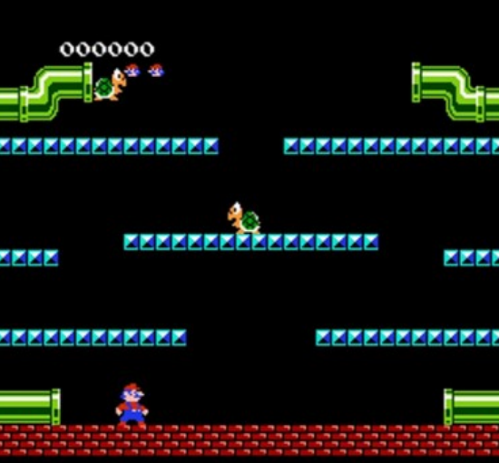

# Classic_Mario_OOP
## Simple Mario Game
This is a simple Mario game developed using object-oriented programming principles and the SFML library. The game is designed to provide a fun and interactive experience for players, reminiscent of the classic Super Mario games.

## Features
 - Player control: Move left, right, and jump to navigate through the level.
 - Enemies: Avoid or defeat various enemies (turtles) to progress through the levels.
 - Visual effects and animations: Enjoy appealing visuals and smooth animations.
## Technologies Used
- Programming Language: C++
- Object-Oriented Programming: Designing classes and objects for efficient code organization and modularity.
- SFML Library: Utilized for graphics rendering and user input handling.
## Getting Started
To run the game locally on your machine, follow these steps:

- Clone the repository: git clone https://github.com/fthsari/Classic_Mario_OOP
- Install the required dependencies (SFML library).
- Build the project using your preferred C++ compiler (VS Studio).
- Run the executable file.
